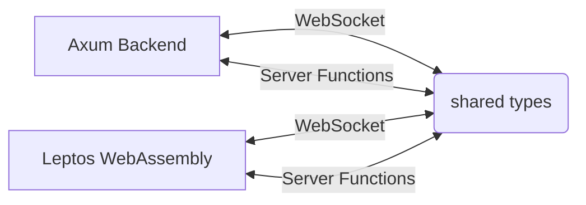

<p align="center">


</p>


# 文字 (Moji)


A high-performance, real-time multiplayer Japanese vocabulary and kanji engine built entirely in Rust. The application leverages a WebAssembly single-page application frontend interacting with a concurrent, lock-optimized Axum WebSocket backend to deliver low-latency game state synchronization.

If you have even basic knowledge of Japanese Kanji, you can try out the [live site](https://moji.fly.dev)!
There are various kanji difficulty lists ranging from the lowest JLPT level (N5) all the way to the highest (N1). You can even mix and match them!

<div align="center">

https://github.com/user-attachments/assets/009cf7c9-29d6-4b95-8100-326a5fe0f7ef

</div>

## Architecture & Technical Implementation

Moji is designed around a strict data-oriented and zero-cost abstraction philosophy, sharing complex type definitions across the network boundary while maintaining high backend throughput.

### Concurrency Model & Lock Optimization

The game state machine must concurrently process incoming WebSocket frames, update game loop counters, and broadcast state to all clients. To achieve this, the application employs a custom `Shared<T>` interior mutability pattern wrapping `Arc<parking_lot::RwLock<T>>`.

```rust
// Core state primitive eliminating async overhead for synchronous operations
#[derive(Clone)]
pub struct Shared<T>(Arc<RwLock<T>>);
```

By explicitly selecting `parking_lot::RwLock` over `tokio::sync::RwLock` for game logic, the engine guarantees that thread-blocking locks are never held across `.await` points. This prevents Tokio worker thread starvation and yields a significant reduction in cache locality issues and context-switching overhead for synchronous state mutations (such as score increments and turn advancements).

### Memory Layout & Dictionary Lookups

To avoid disk I/O bottlenecks during active gameplay, the entire Jōyō Kanji list and JMdict vocabulary datasets are vectorized and loaded into memory at startup. Lookups are handled via an $O(1)$ `HashSet` implementation.

```text
Memory Layout (Pre-loaded Dictionary):
+-----------------+------------------------------------------+
| Arc<DictData>   | HashSet<String> (Fast Validations)       |
+-----------------+------------------------------------------+
| Arc<KanjiData>  | Vec<Vec<Kanji>> (Level-Indexed)          |
+-----------------+------------------------------------------+
| Arc<WordData>   | Vec<HashMap<String, Vec<String>>>        |
+-----------------+------------------------------------------+
```

When a user submits a guess, the payload validates entirely in memory without ever hitting a database. To ensure game variety, kanji selection does not use a naive uniform distribution. Instead, it utilizes a `WeightedIndex` based on real-world frequency data, constructed lazily during lobby initialization and cached for the duration of the match.

### Isomorphic Rust & Compile-Time Safety

The system uses a unified monorepo structure where the Leptos WebAssembly frontend and Axum backend depend on a common `shared` crate.



This isomorphic architecture allows the compiler to guarantee that API contracts and WebSocket payloads are identical on both ends. Deserialization errors are eliminated, as a change to the `ServerMessage` enum instantly breaks compilation for both the client and the server if not handled universally.

### Real-time Event Loop & Connection Handling

Each client connection spawns isolated Tokio `send` and `receive` tasks bridged by a `tokio::sync::broadcast` channel.

*   **Rate Limiting**: The `receive` task implements a localized token bucket algorithm (capped at 20 msgs/sec) to drop malicious WebSocket spam before it can acquire the `LobbyState` lock.
*   **Garbage Collection**: Disconnections increment a `cleanup_generation` counter. A delayed Tokio task re-evaluates the generation after a timeout, gracefully destroying the lobby memory and writing final telemetry data to PostgreSQL via `sqlx` only if the generation remains unmutated (ensuring ephemeral disconnects do not interrupt games).

## Features

*   **Multi-Mode Engine**: Configurable game state machine supporting Deathmatch, Duel (turn-based elimination), and Zen modes.
*   **Configurable JLPT Difficulty**: Dynamic dictionary subsets and kanji weighting algorithms based on Japanese Language Proficiency Test levels (N5-N1).
*   **Persistent Telemetry**: Asynchronous database writes using compile-time validated `sqlx` queries (with offline cache support) to track global metrics without blocking the game loop.
*   **Argon2 Auth & Guest Sessions**: JSON Web Token (JWT) based authentication supporting both permanent, securely hashed accounts and ephemeral guest sessions.


## Build & Run Instructions

### Prerequisites

*   Rust toolchain (`stable`)
*   `wasm32-unknown-unknown` target
*   PostgreSQL
*   [Trunk](https://trunkrs.dev)
*   [Bun](https://bun.sh)

### Local Development

1. **Clone the repository:**
   ```bash
   git clone https://github.com/CldStlkr/moji.git
   cd moji
   ```

2. **Initialize Database:**
   ```bash
   createdb moji
   export DATABASE_URL=postgres://localhost/moji
   cargo install sqlx-cli
   sqlx migrate run --source backend/migrations
   ```

3. **Compile and run the Axum backend:**
   ```bash
   cargo run --bin moji-server
   ```

4. **In a separate terminal, bundle the Leptos frontend:**
   ```bash
   rustup target add wasm32-unknown-unknown
   cd frontend
   bunx tailwindcss -i ./input.css -o ./styles.css
   trunk serve
   ```

The application will be accessible at `http://localhost:8080`.
